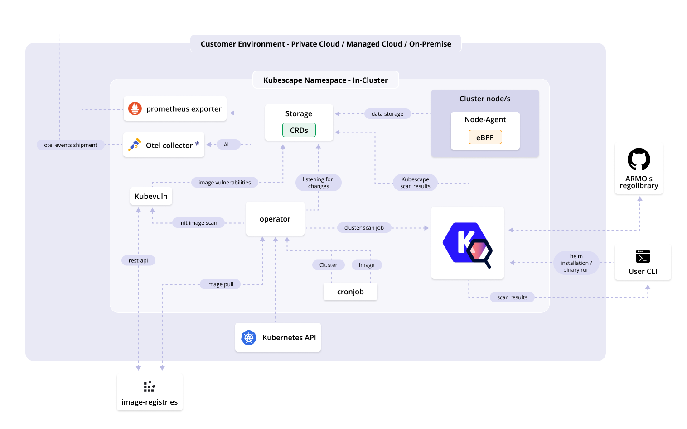

[](https://github.com/kubescape/kubescape/releases)
[](https://github.com/kubescape/kubescape/actions/workflows/02-release.yaml)
[](https://goreportcard.com/report/github.com/kubescape/kubescape)
[](https://gitpod.io/#https://github.com/kubescape/kubescape)
[](https://github.com/kubescape/kubescape/blob/master/LICENSE)
[](https://landscape.cncf.io/?item=provisioning--security-compliance--kubescape)
[](https://artifacthub.io/packages/search?repo=kubescape)
[](https://app.fossa.com/projects/git%2Bgithub.com%2Fkubescape%2Fkubescape?ref=badge_shield&issueType=license)
[](https://www.bestpractices.dev/projects/6944)
[](https://securityscorecards.dev/viewer/?uri=github.com/kubescape/kubescape)
[](https://github.com/kubescape/kubescape/stargazers)
[](https://twitter.com/kubescape)
[](https://cloud-native.slack.com/archives/C04EY3ZF9GE)

# Kubescape

<picture>
  <source media="(prefers-color-scheme: dark)" srcset="https://raw.githubusercontent.com/cncf/artwork/master/projects/kubescape/stacked/white/kubescape-stacked-white.svg" width="150">
  <source media="(prefers-color-scheme: light)" srcset="https://raw.githubusercontent.com/cncf/artwork/master/projects/kubescape/stacked/color/kubescape-stacked-color.svg" width="150">
  
</picture>

_Comprehensive Kubernetes Security from Development to Runtime_

Kubescape is an open-source Kubernetes security platform that provides comprehensive security coverage, from left to right across the entire development and deployment lifecycle. It offers hardening, posture management, and runtime security capabilities to ensure robust protection for Kubernetes environments. It saves Kubernetes users and admins precious time, effort, and resources.

Kubescape scans clusters, YAML files, and Helm charts. It detects misconfigurations according to multiple frameworks (including [NSA-CISA](https://www.armosec.io/blog/kubernetes-hardening-guidance-summary-by-armo/?utm_source=github&utm_medium=repository), [MITRE ATT&CK®](https://www.armosec.io/glossary/mitre-attck-framework/?utm_source=github&utm_medium=repository) and the [CIS Benchmark](https://www.armosec.io/blog/cis-kubernetes-benchmark-framework-scanning-tools-comparison/?utm_source=github&utm_medium=repository)).

Kubescape was created by [ARMO](https://www.armosec.io/?utm_source=github&utm_medium=repository) and is a [Cloud Native Computing Foundation (CNCF) incubating project](https://www.cncf.io/projects/).

_Please [star ⭐](https://github.com/kubescape/kubescape/stargazers) the repo if you want us to continue developing and improving Kubescape! 😀_

## Demo

Kubescape has a command line tool that you can use to quickly get a report on the security posture of a Kubernetes cluster:


## Getting started

Experimenting with Kubescape is as easy as:

```sh
curl -s https://raw.githubusercontent.com/kubescape/kubescape/master/install.sh | /bin/bash
```

This script will automatically download the latest Kubescape CLI release and scan the Kubernetes cluster in your current kubectl context.

Learn more about:

* [Installing the Kubescape CLI](https://kubescape.io/docs/install-cli/)
* [Running your first scan](https://kubescape.io/docs/scanning/)
* [Accepting risk with exceptions](https://kubescape.io/docs/accepting-risk/)

_Did you know you can use Kubescape in all these places?_

<div align="center">
    
</div>

### Continuous security monitoring with the Kubescape Operator

As well as a CLI, Kubescape provides an in-cluster mode, which is installed via a Helm chart. Kubescape in-cluster provides extensive features such as continuous scanning, image vulnerability scanning, runtime analysis, network policy generation, and more. [Learn more about the Kubescape operator](https://kubescape.io/docs/operator/).

### Using Kubescape as a GitHub Action

Kubescape can be used as a GitHub Action. This is a great way to integrate Kubescape into your CI/CD pipeline. You can find the Kubescape GitHub Action in the [GitHub Action marketplace](https://github.com/marketplace/actions/kubescape).

## Under the hood

Kubescape uses [Open Policy Agent](https://github.com/open-policy-agent/opa) to verify Kubernetes objects against [a library of posture controls](https://github.com/kubescape/regolibrary).
For image scanning, it uses [Grype](https://github.com/anchore/grype).  
For image patching, it uses [Copacetic](https://github.com/project-copacetic/copacetic).
For eBPF, it uses [Inspektor Gadget](https://github.com/inspektor-gadget)

By default, CLI scan results are printed in a console-friendly manner, but they can be:

* exported to JSON, junit XML or SARIF
* rendered to HTML or PDF
* submitted to a [cloud service](docs/providers.md)

### In-cluster architecture 



## Community

Kubescape is an open source project. We welcome your feedback and ideas for improvement. We are part of the CNCF community and are evolving Kubescape in sync with the security needs of Kubernetes users. To learn more about where Kubescape is heading, please check out our [ROADMAP](https://github.com/kubescape/project-governance/blob/main/ROADMAP.md).

If you feel inspired to contribute to Kubescape, check out our [CONTRIBUTING](https://github.com/kubescape/project-governance/blob/main/CONTRIBUTING.md) file to learn how. You can find the issues we are working on (triage to development) on the [Kubescaping board](https://github.com/orgs/kubescape/projects/4/views/1)

* Feel free to pick a task from the [board](https://github.com/orgs/kubescape/projects/4) or suggest a feature of your own.
* Open an issue on the board. We aim to respond to all issues within 48 hours.
* [Join the CNCF Slack](https://slack.cncf.io/) and then our [users](https://cloud-native.slack.com/archives/C04EY3ZF9GE) or [developers](https://cloud-native.slack.com/archives/C04GY6H082K) channel.

The Kubescape project follows the [CNCF Code of Conduct](https://github.com/cncf/foundation/blob/master/code-of-conduct.md).

For more information about the Kubescape community, please visit [COMMUNITY](https://github.com/kubescape/project-governance/blob/main/COMMUNITY.md).


We would like to take this opportunity to thank all our contibutors to date.

<br>

<a href = "https://github.com/kubescape/kubescape/graphs/contributors">
  
</a>

## Changelog

Kubescape changes are tracked on the [release](https://github.com/kubescape/kubescape/releases) page.

## License

Copyright 2021-2025, the Kubescape Authors. All rights reserved. Kubescape is released under the Apache 2.0 license. See the [LICENSE](LICENSE) file for details.

Kubescape is a [Cloud Native Computing Foundation (CNCF) incubating project](https://www.cncf.io/projects/kubescape/) and was contributed by [ARMO](https://www.armosec.io/?utm_source=github&utm_medium=repository).

<div align="center">
    
</div>
